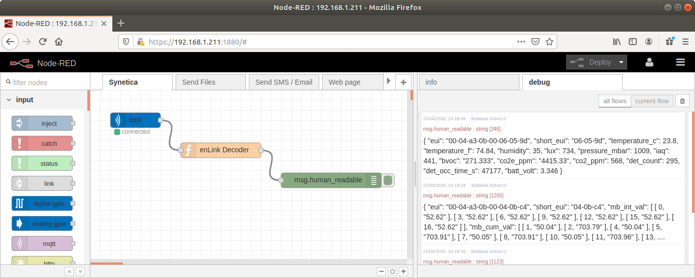

# Synetica - enLink LoRaWAN decoders

Online decoder can be found here: [Live Decoder](https://synetica.github.io/enlink-decoder/)

## Table of Contents
- [Preamble](#preamble)
- [Payload Contents of each enLink Model](#payload-contents-of-each-enlink-model)
  - [AIR/AIR-X](#enlink-airair-x---indooroutdoor-air-quality-monitor)
  - [IAQ/OAQ](#enlink-iaqoaq---indooroutdoor-air-quality)
  - [ZonePlus](#enlink-zoneplus)
  - [Zone](#enlink-zone)
  - [Modbus](#enlink-modbus)
  - [Status Pulse Counter](#enlink-status---pulse-counter)
  - [Status Leak Sensor](#enlink-status---leak-sensor)
  - [Status Differential Pressure](#enlink-status---differential-pressure--air-flow-velocity)
  - [Status Absolute Pressure](#enlink-status---absolute-pressure)
  - [Status Temperature Probes](#enlink-status---temperature-probes)
  - [Status Voltage/Current Sensor](#enlink-status---voltagecurrent-sensor)
  - [Status Pura Sanitiser Liquid Level](#enlink-status---pura-sanitiser-liquid-level)
- [Uplink Payload](#uplink-payload)
  - [Uplink Payload Structure](#uplink-payload-structure)
  - [Uplink Transmission Port](#uplink-transmission-port)
  - [Sensor Details](#sensor-details)
  - [Decoding Complex Messages](#decoding-complex-messages)
  - [enLink KPI Payload Data](#enlink-kpi-payload-data)
- [Downlink Payload](#downlink-payload)
  - [Downlink Payload Structure](#downlink-payload-structure)
  - [Downlink Receive Port](#downlink-receive-port)
  - [General Settings Details](#general-settings-details)
  - [Downlink Message Examples](#downlink-message-examples)
  - [Example Uplink Replies to Downlink Messages](#example-uplink-replies-to-downlink-messages)
  - [Downlink Message Index Tables](#downlink-message-index-tables)
  - [Light Sensor Parameters](#light-sensor-parameters)
  - [AQM / Air Parameters](#aqm--air-parameters)
  - [CO2 Sensor Parameters](#carbon-dioxide-sensor-parameters)
  - [Particulate Sensor Parameters](#particulate-sensor-parameters)
  - [Gas Sensor Parameters](#gas-sensor-parameters)
  - [Leak Sensor Parameters](#leak-sensor-parameters)
  - [VOC Sensor Parameters](#voc-sensor-parameters)
  - [Sample Code](#sample-code)

 

# Preamble

**[Synetica](https://www.synetica.net)** is a UK based company that designs and develops energy and environmental sensors. We specialise in highly accurate and reliable air quality monitoring using LoRaWAN long range wireless.

The **enLink** range of LoRaWAN devices are categorised into the following:
- Air Quality Monitors (Indoor and Outdoor, mains and battery powered)
- Indoor Environmental Sensors
- Modbus Reader - Serial RS485 RTU
- Pulse Counter
- Leak Sensor
- Differential Pressure / Air Flow
- Temperature Probes
- Voltage/Current Sensor

This repository contains various decoders for the LoRaWAN data packets. The uplink data is telemetry data containing values like temperature, particulates and gas concentrations.

This enLink firmware implements LoRa Mac 4.4.0 release from Semtech/StackForce [LoRaMac-Node](https://github.com/Lora-net/LoRaMac-node/tree/f42be67be402a40b3586724800771bfe13fb18e6).

We implement EU863-870 and US902-928 (Hybrid mode) as defined in [LoRaWAN Regional Parameters v1.0.2rB](https://lora-alliance.org/resource_hub/lorawan-regional-parameters-v1-0-2rb/) document. Class A endpoint implementation is fully compatible with "LoRaWAN specification 1.0.2".

 

# Payload Contents of each enLink Model

Each model of enLink device has specific sensors. Each sensor exposes one or more data values. The **firmware code** is used to determine the sensors in the device. Note: the product code is similar to, but not the same as the firmware code. The following table can be used to determine the expected values in a uplink message. The [KPI](#enlink-kpi-payload-data) values are optional.

The firmware code is a concatenation of the base model plus the options.

>For example: `FW-ZN-LVCM` is the firmware code for an enLink Zone(**ZN**) with **L**ight, **V**OCs, **C**O2 and **M**otion.

## enLink AIR/AIR-X - Indoor/Outdoor Air Quality Monitor

| Firmware Code | Options | Data Type(s) | Description |
|:-----------|:--------|:-------------|:------------|
| FW-AQM  | (default) | `0x01`, `0x02` | Temperature, Humidity
| | L | `0x03` | Light Level (Indoor only)
| | V | `0x04`, `0x05`, `0x12`, `0x3F` | Pressure, VOC IAQ, bVOC, CO2e
| | C | `0x08` | NDIR CO2 ppm
| | X | `0x06` | Oxygen
| | K | `0x07`, `0x09`, `0x0A`, `0x0D`, `0x53`, `0x54`, `0x55`, `0x56` | Optional Gas Socket Sensors
| | S | `0x50`, `0x51`, `0x52` | Sound
| | P+ | `0x57`, `0x58`, `0x59`, `0x5A`, `0x5B`, `0x5C`, `0x5D`, `0x5E`,`0x5F`, `0x60` | Particles
| | O | `0x61` | Ozone
| | G | `0x61`, `0x66` | Single Gas Sensor
| | G+ | `0x61`, `0x66` | Up to 4 x Gas Sensors

## enLink IAQ/OAQ - Indoor/Outdoor Air Quality

| Firmware Code | Options | Data Type(s) | Description |
|:-----------|:--------|:-------------|:------------|
| FW-AQ  | (default) | `0x01`, `0x02` | Temperature, Humidity
| | V | `0x04`, `0x05`, `0x12`, `0x3F` | Pressure, VOC IAQ, bVOC, CO2e
| | C | `0x08` | NDIR CO2 ppm
| | D | `0x67`, `0x68` | Outdoor EPA Sensor
| | O | `0x61` | Ozone
| | G | `0x61`, `0x66` | Single Gas Sensor
| | S | `0x50`, `0x51`, `0x52` | Sound
| | P+ | `0x57`, `0x58`, `0x59`, `0x5A`, `0x5B`, `0x5C`, `0x5D`, `0x5E`, `0x5F`, `0x60` | Particles
| | PP | `0x69`, `0x6A`, `0x6B`, `0x57`, `0x58`, `0x6C`,  `0x5A`, `0x6D`, `0x6E`, `0x5B`, `0x5C`, `0x5D`,  `0x6F`, `0x5F` | Particles (Piera Sensor) **Unit must be externally powered**
| | PV | `0x69`, `0x6A`, `0x6B`, `0x57`, `0x58`, `0x6C`,  `0x5A`, `0x6D`, `0x6E`, `0x5B`, `0x5C`, `0x5D`,  `0x6F`, `0x5F`, `0x70`, `0x71`, `0x72` | Particles, Smoke/Vape **Unit must be externally powered**

## enLink ZonePlus

| Firmware Code | Options | Data Type(s) | Description |
|:-----------|:--------|:-------------|:------------|
| FW-ZNP  | (default) | `0x01`, `0x02` | Temperature, Humidity
| | L | `0x03` | Light Level
| | V | `0x04`, `0x05`, `0x12`, `0x3F` | Pressure, VOC IAQ, bVOC, CO2e
| | C | `0x08` | NDIR CO2 ppm
| | M | `0x13`, `0x14` | Motion (PIR). Includes [ATI](#ati---adaptive-transmission-interval) feature
| | S | `0x50`, `0x51`, `0x52` | Sound
| | P+ | `0x57`, `0x58`, `0x59`, `0x5A`, `0x5B`, `0x5C`, `0x5D`, `0x5E`, `0x5F`, `0x60` | Particles

## enLink Zone

| Firmware Code | Options | Data Type(s) | Description |
|:-----------|:--------|:-------------|:------------|
| FW-ZN  | (default) | `0x01`, `0x02` | Temperature, Humidity
| | L | `0x03` | Light Level
| | V | `0x04`, `0x05`, `0x12`, `0x3F` | Pressure, VOC IAQ, bVOC, CO2e
| | C | `0x08` | NDIR CO2 ppm
| | M | `0x13`, `0x14` | Motion (PIR). Includes [ATI](#ati---adaptive-transmission-interval) feature

## enLink Modbus

| Firmware Code | Options | Data Type(s) | Description |
|:-----------|:--------|:-------------|:------------|
| FW-MB-32  | (None)  | `0x0F`, `0x10`, `0x11` | Exception, Interval, Cumulative readings

## enLink Status - Pulse Counter

| Firmware Code | Options | Data Type(s) | Description |
|:-----------|:--------|:-------------|:------------|
| FW-STS-P/PX | (None) | `0x0E`, `0x15` | Count (0 to 2^32), [Change of State](#pulse-counters---change-of-state) - Includes [ATI](#ati---adaptive-transmission-interval) feature

## enLink Status - Leak Sensor

| Firmware Code | Options | Data Type(s) | Description |
|:-----------|:--------|:-------------|:------------|
| FW-STS-L  | (None)  | `0x30`, `0x31` | Resistance, Leak Event. Includes [ATI](#ati---adaptive-transmission-interval) feature on the leak event

## enLink Status - Differential Pressure / Air Flow (Velocity)

| Firmware Code | Options | Data Type(s) | Description |
|:-----------|:--------|:-------------|:------------|
| FW-STS-DP/AF | (None)  | `0x2C`, `0x2D` | Pressure, Air flow. Either one or both can be selected

## enLink Status - Absolute Pressure

| Firmware Code | Options | Data Type(s) | Description |
|:-----------|:--------|:-------------|:------------|
| FW-STS-AP  | (None)  | `0x32`, `0x33` | Pressure, Temperature (of the sensor)

## enLink Status - Temperature Probes

| Firmware Code | Options | Data Type(s) | Description |
|:-----------|:--------|:-------------|:------------|
| FW-STS | 1T | `0x17`, `0x1A`, `0x1D`, `0x20`, `0x23`, `0x26`, `0x29` | Temperature, alarm status (if set) Includes [ATI](#ati---adaptive-transmission-interval) feature
| | 2T  | As above, plus `0x18`, `0x1B`, `0x1E`, `0x21`, `0x24`, `0x27`, `0x2A` | Temperature, alarm status (if set) Includes [ATI](#ati---adaptive-transmission-interval) feature

## enLink Status - Voltage/Current Sensor

| Firmware Code | Options | Data Type(s) | Description |
|:-----------|:--------|:-------------|:------------|
| FW-STS-VC | (None)  | `0x2E` | Mode: Voltage
|            |         | `0x2F` | Mode: Current
|            |         | `0x30` | Mode: Resistance

## enLink Status - Pura Sanitiser Liquid Level

| Firmware Code | Options | Data Type(s) | Description |
|:-----------|:--------|:-------------|:------------|
| FW-STS-PURA  | (None)  | `0x16` | Status Changed

## ATI - Adaptive Transmission Interval

This is included on enLink devices where an alarm or status feature requires immediate transfer of a radio message. When a change of alarm state occurs a wireless message is sent immediately, however messages will not be sent more frequently than the **Adaptive Min interval**. The **Adaptive Max interval** acts like a heartbeat, so if no change of alarm state occurs then a message is sent at the Adaptive Max interval.

 

# Uplink Payload

The enLink payload structure is designed to be as efficient as possible. Data for multiple sensor values can be concatenated into a single payload which can be easily decoded. If the payload length is restricted due to channel time limits, the whole message will be split into multiple payloads. Each payload will always be split on a **Sensor Data** boundary. This is done so each payload can be easily decoded. A payload will always have the first byte as a **Data Type Identifier**.

## Uplink Transmission Port

The enLink device design uses a single port byte value to transmit uplink messages. This is by default set to 1. This can be changed to allow the user to easily decode packets from different manufacturers, if needed. This can be changed either via the serial port menu, accessed by a USB cable or with a downlink message.

## Uplink Payload Structure

The payload is an array of `Sensor Data` messages, each on is 2 or more bytes in length.

> `[Sensor-1 Data]  [Sensor-2 Data] ... [Sensor-n Data]`

 

Sensor data consists of a `Data Type Identifier` byte followed by the `Data Value` as one or more bytes. The number of bytes in the data value is determined by the Data Type Identifier and is fixed. Details are here: [Sensor Details](#sensor-details).

> Example Payload (hexadecimal): `01 01 23 02 56 03 01 A4`

These bytes can be split up as follows:

> Example Payload: `[01 01 23] [02 56] [03 01 A4]`

Finally, decoding the data:

| Data Type Identifier | Data Value Calculation | Result |
|:---------------------|:-----------------------|:------ |
| `01` - Temperature   | ((`0x01` * 256) + `0x23`) / 10 = (256 + 35) / 10 | 29.1 °C |
| `02` - Humidity      | `0x56` | 86 %rH |
| `03` - Ambient Light | (`0x01` * 256) + `0xA4` = 256 + 164 | 420 Lux |

Each **Data Type** can use 1 or more bytes to send the value according to the following table:

 

## Sensor Details

| Type Hex&nbsp;Dec| Sensor | Sensor Range | Units | Num Bytes | Format | Scaling |
|:---------:| ------ | ------------ | ----- |:---------:|:-----------:| ------- |
| `0x01` 001 | Temperature | -40 to 85 | °C | 2 | S16 | / 10
| `0x02` 002 | Humidity | 0 to 100 | % | 1 | U8
| `0x03` 003 | Ambient Light | 0.01 to 83k | lux | 2 | U16
| `0x04` 004 | Pressure | 300 to 1100 | mbar | 2 | U16
| `0x05` 005 | Volatile Organic Compounds (VOC) See: [BOSCH Datasheet](https://www.bosch-sensortec.com/media/boschsensortec/downloads/datasheets/bst-bme680-ds001.pdf) | 0 to 500 | IAQ | 2 | U16
| `0x06` 006 | Oxygen | 0 to 25 | % | 1 | U8 | / 10
| `0x07` 007 | Carbon Monoxide | 0 to 100  | ppm | 2 | U16 | / 100
| `0x08` 008 | Carbon Dioxide (2 sensor ranges) | 0 to 5000 or 0 to 50,000 | ppm | 2 | U16 | 
| `0x09` 009 | Ozone (O3) | 0 to 1 0 to 1000 | ppm ppb | 2 | U16 | / 10000 / 10
| `0x0A` 010 | Air Pollutants: CO, Ammonia, Ethanol, H2, Methane / Propane / Iso-Butane. | 100 to 1500 (Typ)| kΩ | 2 | U16 | / 10
| `0x0B` 011 | Particulate Matter 2.5 | 0 to 1000 | µg/m3 | 2 | U16
| `0x0C` 012 | Particulate Matter 10  | 0 to 1000 | µg/m3 | 2 | U16
| `0x0D` 013 | Hydrogen Sulphide (H2S) | 0 to 100 | ppm | 2 | U16 | / 100
| `0x0E` 014 | Pulse ID + Pulse Counter | ID: 0 to 3 Value: 0 to 2^32 | count | 1 + 4 | U32
| `0x0F` 015 | MB ID + Modbus Exception | ID: 0 to 31 Error Num | | 1 + 1 | U8
| `0x10` 016 | MB ID + Modbus Interval value | ID: 0 to 31 Interval Value | | 1 + 4 | F32
| `0x11` 017 | MB ID + Modbus Cumulative value | ID: 0 to 31 Cumulative&nbsp;Value | | 1 + 4 | F32
| `0x12` 018 | bVOC – VOC concentration |  | ppm | 4 | F32
| `0x13` 019 | Detection count (PIR etc.) |  | count | 4 | U32
| `0x14` 020 | Total occupied time |  | seconds | 4 | U32
| `0x15` 021 | Change of State information | [Change of State](#pulse-counters---change-of-state) |  | 3 | U16
| `0x16` 022 | Liquid Level Status | 0 = No Liquid 1 = Detected | status | 1 | U8
| `0x17` 023 | Probe 1 Temperature | -55 to 125 | °C | 2 | S16 | / 10
| `0x18` 024 | Probe 2 Temperature | -55 to 125 | °C | 2 | S16 | / 10
| `0x19` 025 | Probe 3 Temperature | -55 to 125 | °C | 2 | S16 | / 10
| `0x1A` 026 | Time temperature probe 1 has spent in 'in band' zone |  | seconds | 4 | U32
| `0x1B` 027 | Time temperature probe 2 has spent in 'in band' zone |  | seconds | 4 | U32
| `0x1C` 028 | Time temperature probe 3 has spent in 'in band' zone |  | seconds | 4 | U32
| `0x1D` 029 | Number of times in band alarm has been activated for temperature probe 1 |  | count | 2 | U16
| `0x1E` 030 | Number of times in band alarm has been activated for temperature probe 2 |  | count | 2 | U16
| `0x1F` 031| Number of times in band alarm has been activated for temperature probe 3 |  | count | 2 | U16
| `0x20` 032 | Time temperature probe 1 has spent below low threshold |  | seconds | 4 | U32
| `0x21` 033 | Time temperature probe 2 has spent below low threshold |  | seconds | 4 | U32
| `0x22` 034 | Time temperature probe 3 has spent below low threshold |  | seconds | 4 | U32
| `0x23` 035 | Number of times low threshold alarm has been activated for temperature probe 1  |  | count | 2 | U16
| `0x24` 036 | Number of times low threshold alarm has been activated for temperature probe 2 |  | count | 2 | U16
| `0x25` 037 | Number of times low threshold alarm has been activated for temperature probe 3 |  | count | 2 | U16
| `0x26` 038 | Time temperature probe 1 has spent above high threshold |  | seconds | 4 | U32
| `0x27` 039 | Time temperature probe 2 has spent above high threshold |  | seconds | 4 | U32
| `0x28` 040 | Time temperature probe 3 has spent above high threshold |  | seconds | 4 | U32
| `0x29` 041 | Number of times high threshold alarm has been activated for temperature probe 1  |  | count | 2 | U16
| `0x2A` 042 | Number of times high threshold alarm has been activated for temperature probe 2 |  | count | 2 | U16
| `0x2B` 043 | Number of times high threshold alarm has been activated for temperature probe 3 |  | count | 2 | U16
| `0x2C` 044 | Differential Pressure | +/- 5000 | Pa | 4 | F32
| `0x2D` 045 | Airflow | 0 to 100 | m/s   | 4 | F32
| `0x2E` 046 | Voltage | 0 to 10  | Volts | 2 | U16 | / 1000
| `0x2F` 047 | Current | 0 to 20  | mA    | 2 | U16 | / 1000
| `0x30` 048 | Resistance | 0 to 6553.5 kΩ (6.5MΩ) | kΩ | 2 | U16 | / 10
| `0x31` 049 | Leak Detection (resistance rope) | 0 = No Leak 1 = Leak Detected | status | 1 | U8
| `0x32` 050 | Absolute Pressure | 0 to 1000 kPa typ. | Pa | 4 | F32
| `0x33` 051 | Sensor Temperature | -40 to 85 | °C | 2 | S16 | /100
| `0x3F` 063 | CO2e estimate equivalent |  | ppm | 4 | F32
| `0x50` 080 | Sound Level Minimum |  | dB(A) | 4 | F32
| `0x51` 081 | Sound Level Average |  | dB(A) | 4 | F32
| `0x52` 082| Sound Level Maximum |  | dB(A) | 4 | F32
| `0x53` 083 | Nitric Oxide     | 0 - 100 | ppm | 2 | U16 | / 100
| `0x54` 084 | Nitrogen Dioxide | 0 – 5   | ppm | 2 | U16 | / 10000
| `0x55` 085 | Nitrogen Dioxide | 0 – 20  | ppm | 2 | U16 | / 1000
| `0x56` 086 | Sulphur Dioxide  | 0 – 20  | ppm | 2 | U16 | / 1000
| `0x57` 087 | Particulate matter mass concentration at PM1.0 |  | µg/m³ | 4 | F32
| `0x58` 088 | As above, PM2.5  |  | µg/m³ | 4 | F32
| `0x59` 089 | As above, PM4.0  |  | µg/m³ | 4 | F32
| `0x5A` 090 | As above, PM10.0 |  | µg/m³ | 4 | F32
| `0x5B` 091 | Particulate matter number concentration at PM0.5 |  | #/cm³ | 4 | F32
| `0x5C` 092 | As above, PM1.0  |  | #/cm³ | 4 | F32
| `0x5D` 093 | As above, PM2.5  |  | #/cm³ | 4 | F32
| `0x5E` 094 | As above, PM4.0  |  | #/cm³ | 4 | F32
| `0x5F` 095 | As above, PM10.0 |  | #/cm³ | 4 | F32
| `0x60` 096 | Particulate matter typical particle size |  | µm | 4 | F32
| `0x61` 097 | Gas ID + Gas Concentration |  | ppb | 1 + 4 | F32
| `0x62` 098 | Corrosion: Metal ID + Metal Thickness | ~ 1000nm | nm | 1 + 4 | F32
| `0x63` 099 | Corrosion: Metal ID + Minimum thickness |  | nm | 1 + 2 | U16
| `0x64` 100 | Corrosion: Metal ID + Original thickness |  | nm | 1 + 2 | U16
| `0x65` 101 | Corrosion: percentage of thickness between original thickness (100%) and minimum (0%) |  | % | 1 + 4 | F32
| `0x66` 102 | Gas ID + Gas Concentration |  | µg/m³ | 1 + 4 | F32
| `0x67` 103 | Outdoor EPA Index Sensor Fast AQI (reading taken over 1 minute) | 0 to 500 | AQI | 2 | U16
| `0x68` 104 | Outdoor EPA Index Sensor EPA AQI See: [AirNow Technical Doc](https://www.airnow.gov/sites/default/files/2020-05/aqi-technical-assistance-document-sept2018.pdf) | 0 to 500 | AQI | 2 | U16
| `0x69` 105 | Particulate matter mass concentration at PM0.1 |  | µg/m³ | 4 | F32
| `0x6A` 106 | As above, PM0.3  |  | µg/m³ | 4 | F32
| `0x6B` 107 | As above, PM0.5  |  | µg/m³ | 4 | F32
| `0x6C` 108 | As above, PM5.0  |  | µg/m³ | 4 | F32
| `0x6D` 109 | Particulate matter number concentration at PM0.1 |  | #/cm³ | 4 | F32
| `0x6E` 110 | As above, PM0.3  |  | #/cm³ | 4 | F32
| `0x6F` 111 | As above, PM5.0  |  | #/cm³ | 4 | F32
| `0x70` 112 | Detection: Event Count  | 0 to 65535 | count | 2 | U16
| `0x71` 113 | Detection: Smoke Count  | 0 to 65535 | count | 2 | U16
| `0x72` 114 | Detection: Vape Count   | 0 to 65535 | count | 2 | U16

 

## Decoding Complex Messages

Most sensor data values are self-explanatory, additional information for decoding more complex sensor data is given in the sections below.

### Modbus

Types: `0x0F`, `0x10`, `0x11`

The enLink Modbus data types for Interval and Cumulative values use 5 bytes to encode the `item index` and `value`.

- Modbus Exception – standard Modbus exception codes, e.g. Code `02` – Illegal Data Address.
- Modbus Interval Value – for Modbus data types which do not accumulate, e.g. Voltage, Current, Temperature etc.
- Modbus Cumulative Value – for Modbus data types which are linked to a value which accumulates, e.g. kWh, Volume etc.

The first byte indicates which of the 32 available Modbus items is being accessed (0 to 31), followed by the Modbus Value represented as a 32 bit floating point value (IEEE754 format). Interval Value types are used for instantaneous values, such as Voltage, Current, Temperature, Pressure etc. Cumulative Values are used for items such as energy consumption and total volume.

> Example Payload Data: `10 04 41 BC 7A E1`

This is an interval data value, from configured item number 5. The value is 23.56.

For an online converter, see [Hex to Float Converter](https://gregstoll.com/~gregstoll/floattohex/)

 

### Pulse Counters - Change of State

---

Type: `0x15`

The full message is sent as 3 bytes. The second byte indicates the reason for the radio transmission (Trigger Status), the third byte gives the open/close state of the inputs (Input State).

> Note: To enable the Change-of-State feature to transmit when a change is detected, the device configuration requires that **[ATI](#ati---adaptive-transmission-interval)** is enabled, and the **Transmit on Change of State** option is enabled.

The two data value bytes are bit-encoded as follows:

### Trigger Status

- Bit 0 - Set to 1 when Input 1 Changed from *Closed* to *Open*
- Bit 1 - Set to 1 when Input 2 Changed from *Closed* to *Open*
- Bit 2 - Set to 1 when Input 3 Changed from *Closed* to *Open*
- Bit 3 - Not used
- Bit 4 - Set to 1 when Input 1 Changed from *Open* to *Closed*
- Bit 5 - Set to 1 when Input 2 Changed from *Open* to *Closed*
- Bit 6 - Set to 1 when Input 3 Changed from *Open* to *Closed*
- Bit 7 - Not used

If a message is received and the *trigger status* byte value is zero, then the message was either sent after a config button press, or because a regular transmission was scheduled. I.e. the ATI maximum interval has expired. In the NodeRed example decoder, this event is marked as a *heartbeat*.

You may receive a *trigger status* byte value where multiple bits are set. This could be that these events occurred before the radio packet could be sent. For example, a fast transition from *open* -> *closed* -> *open*. This may also be caused by a duty cycle restriction delaying the transmission, or the message sending was paused because a previous message was sent within the minimum ATI interval.

### Input State

- Bit 0 - Input 1 state. Set to 1 when *Closed*
- Bit 1 - Input 2 state. Set to 1 when *Closed*
- Bit 2 - Input 3 state. Set to 1 when *Closed*
- Bit 3 - Not used
- Bit 4 - Not used
- Bit 5 - Not used
- Bit 6 - Not used
- Bit 7 - Not used

> Example Payload Data: `15 01 05`

 

The example shows the transmission was triggered when Input #1 changed from *Closed* to *Open*, and the state of the inputs are:

- Input 1: Closed
- Input 2: Open
- Input 3: Closed

 

### Gas Readings

---

Types: `0x61`, `0x66`

The full message is sent as 6 bytes. For example:

> Example Payload Data: `61 19 41 BC 7A E1`

 

Ths translates to Gas Type `0x19` or 25 which is **Carbon Monoxide**. The value is 23.56 ppb.

The Gas types are listed here:

|  |  |  |
|--|--|--|
| `0x17` - Formaldehyde - HCHO / CH2O</li> | | `0x1E` - Hydrogen Cyanide - HCN
| `0x18` - Volatile Organic Compounds</li>            | | `0x1F` - Hydrogen Fluoride - HF
| `0x19` - Carbon Monoxide - CO</li>                  | | `0x20` - Ammonia - NH3
| `0x1A` - Chlorine - Cl2</li>             | | `0x21` - Nitrogen Dioxide - NO2
| `0x1B` - Hydrogen - H2</li>              | | `0x22` - Oxygen - O2
| `0x1C` - Hydrogen Sulphide - H2S</li>    | | `0x23` - Ozone - O3
| `0x1D` - Hydrogen Chloride - HCl</li>               | | `0x24` - Sulphur Dioxide / Sulfur Dioxide (IUPAC) - SO2

### Corrosion

---

Types: `0x62`, `0x63`, `0x64`, `0x65`

The full message is sent as 6 bytes. The second byte indicates the coupon and sacrificial metal of the sensor.

> Example Payload Data: `62 01 44 58 D0 27`

The example shows Coupon #1 is Copper and the thickness is 867.252 nanometres (equivalent to 8672.52 Ångströms).

Other Coupon/Metal types are:

| Coupon #1 |  | Coupon #2 |
|--|--|--|
| `0x00` - Unknown Metal / Error | | `0x80` - Unknown Metal / Error
| `0x01` - Copper                | | `0x81` - Copper
| `0x02` - Silver                | | `0x82` - Silver
| `0x03` - Chromium              | | `0x83` - Chromium

 

## enLink KPI Payload Data

Each enLink end-node device can have optional Key Performance Indicators (KPI) added to the payload message. Each KPI can use 1 or more bytes to send the value according to the following table.

| Type Hex&nbsp;Dec | KPI             | Comments     | Units | Num Bytes | Format |
|:---------:| --------------- | ------------ | ----- |:---------:| ------ |
| `0x40` 064 | CPU&nbsp;Temperature | Packed Byte. See JS Code | °C | 2 | S16
| `0x41` 065 | Battery Status | 0=Ext Power; 1 - 254 (1.8 - 3.3V); 255=Error | status | 1 | U8
| `0x42` 066 | Battery Voltage | 0 -> 3600 mV (3600=Ext Power) | mV | 2 | U16
| `0x43` 067 | RX RSSI  | Received Signal Strength | dBm | 2 | S16
| `0x44` 068 | RX SNR   | Received Signal-Noise Ratio | dB | 1 | S8
| `0x45` 069 | RX Count | Downlink message count | count | 2 | U16
| `0x46` 070 | TX Time  | Time to send message | ms | 2 | U16
| `0x47` 071 | TX Power | Transmit power | dBm | 1 | S8
| `0x48` 072 | TX Count | Uplink message count | count | 2 | U16
| `0x49` 073 | Power up count | Number of times unit powered up | count | 2 | U16
| `0x4A` 074 | USB insertions count | Number of times USB activated | count | 2 | U16
| `0x4B` 075 | Login OK count | Successful logon count | count | 2 | U16
| `0x4C` 076 | Login fail count | Failed logon count | count | 2 | U16
| `0x4D` 077 | Fan runtime | Total time the air intake fan has run (AIR models only) | seconds | 4 | U32
| `0x4E` 078 | CPU Temperature | New from Ver: 4.9 | °C | 2 | S16 /10

Example code for different LoRaWAN Network Servers (LNS) is included in the folders on this site.

*Screenshot of example using NodeRED*

 

 

# Downlink Payload

Downlink payloads are sent to re-configure the device. When the device processes the payload, it acknowledges the message by transmitting an ACK/NACK and the identifier code. This is to notify the user that the message has been received. An example to decode the ACK/NACK messages that are sent from the end-node to the LNS is included in the NodeRED source.

## Downlink Payload Structure
| Header | Msg Len | Command | Value      |
| ------ | ------- | ------- | ---------- |
| 1 byte | 1 byte  | 1 byte  | *n bytes*  |

The header byte is is always `0xA5`.

**Msg Len** is the number of bytes in the settings data. The settings data starts with a **Command** byte and then the command **Value**. The Value can be empty.

## Downlink Receive Port

When the enLink device receives a downlink message, it first checks the port byte value. If this value matches the expected value, it then attempts to decode the message and process the result. By default the expected value is set to **All**, so it will, in effect, ignore the port value and simple decode and process the message. Only valid port values are allowed, as per the LoRaWAN Specification. These values are 1 to 223.

 

## General Settings Details

| Name | Msg Len | Command | Value | Reboot Required? |
| -----| ------- | ------- | ------| ---------------- |
| Reboot | 1  | `0xFF`
| Antenna Gain (v5.12) | 2  | `0x01` | `0` to `25.5` dBi (single byte `0` to `255`) Default is 2.0 dBi | Yes
| Public Network | 2  | `0x02` | `0`/`1` (Disable/Enable) | Yes
| AppEUI | 9  | `0x05` | 8 Bytes for the **EUI**  | Yes
| AppKey | 17 | `0x06` | 16 bytes for the **Key** | Yes
| Auto Data Rate (ADR) | 2  | `0x07` | `0`/`1` (Disable/Enable)
| Duty Cycle | 2  | `0x08` | `0`/`1` (Disable/Enable)
| Message Confirmation | 2  | `0x09` | `0`/`1` (Disable/Enable)
| Transmit Port | 2  | `0x0A` | `1` to `223` (Default is 1)
| Default Data Rate Index | 2  | `0x0B` | `1` to `6` (Requires ADR disabled)
| Transmit Interval Index | 2  | `0x0C` | `1` to `11` when [ATI](#ati---adaptive-transmission-interval) is available, use `255` (`0xFF`) to activate it
| Transmit Power Index | 2  | `0x0D` | `1` to `6`
| Receive Port | 2  | `0x0E` | `0` to `223` (`0` indicates **All** Ports. Default is **All**)
| Set Join Check Interval (v5.07) | 2 | `0x0F` | `1` to `255` hours
| Set Join Check Packet Type (v5.07) | 2 | `0x10` | `0` = 'Standard' or `1` = 'Single Byte' of value `0x00`
| [ATI](#ati---adaptive-transmission-interval) Min TX Interval Index (v5.08) | 2  | `0x11` | `1` to `11`
| [ATI](#ati---adaptive-transmission-interval) Max TX Interval Index (v5.08) | 2  | `0x12` | `1` to `11`
| * Set Full Packet Multiplier (v5.12) | 2 | `0x13` | `1` to `200`
| ** Set WELL defaults (v5.12) | 2 | `0x14` | `1`

 > \* *Set Full Packet Multiplier* is a feature that enables only the CO2 value to be sent every TX interval. Then, every (*n* x TX Interval), send all the data.  
 As an example; If the transmit interval is set to 10 minutes, a multiplier value of 6 will transmit a full packet every hour, and only the CO2 value the other 10 minute intervals.  
 This feature is enabled in firmware for `ENL-IAQ-C` for WELL standard, on request.

> \** This will change the options to:  
>> Transmit Interval: 10 mins  
Full Packet Multiplier: 6  
Join Check Packet: Single Zero Byte  
VOC included data packets: bVOC and IAQ only  
Particulates included data packets: PM 2.5 and PM 10.0 only
>>  
> This feature is enabled in firmware for `ENL-IAQ-C` for WELL standard, on request.

 

## Downlink Message Examples

### Reboot

> Payload Data:  `A5 01 FF`

### Set Antenna Gain to default (2.0 dBi)

> Payload Data: `A5 02 01 14`

### Enable Message Confirmation

> Payload Data: `A5 02 09 01`

 

## Example Uplink Replies to Downlink Messages

**ACK** (`0x06`) - Successfully changed the Message Confirmation Option (`0x09`)

> Return Data: `A5 06 09`

**NACK** (`0x15`) - failed to change the Transmit Port (`0x0A`)

> Return Data: `A5 15 0A`

 

## Downlink Message Index Tables

The Indexes for some settings depend on the region the unit is programmed for.

`0x0B` - Data Rate Index

| Index | EU868 |   | Index | US915 Hybrid |
| ----- | ----- | - | ----- | ------------ |
| 0 | DR0 SF12 BW125 |  | 0 | DR0 SF10 BW125
| 1 | DR1 SF11 BW125 |  | 1 | DR1 SF9 BW125
| 2 | DR2 SF10 BW125 |  | 2 | DR2 SF8 BW125
| 3 | DR3 SF9 BW125 |  | 3 | DR3 SF7 BW125
| 4 | DR4 SF8 BW125 |  | 4 | DR4 SF8 BW500
| 5 | DR5 SF7 BW125

`0x0C` - Transmit Interval Index

| Index | Transmit Interval | Message |
| -- | -- | -- |
| 1 | 30 s | `A5 02 0C 01`
| 2 | 1 min | `A5 02 0C 02`
| 3 | 2 min | `A5 02 0C 03`
| 4 | 5 min | `A5 02 0C 04`
| 5 | 10 min | `A5 02 0C 05`
| 6 | 15 min | `A5 02 0C 06`
| 7 | 20 min | `A5 02 0C 07`
| 8 | 30 min | `A5 02 0C 08`
| 9 | 1 hour | `A5 02 0C 09`
| 10 | 2 hours | `A5 02 0C 0A`
| 11 | 3 hours | `A5 02 0C 0B`

`0x0D` - Transmit Power Index

| Index | EU868 |   | Index | US195 Hybrid |
| ----- | ------ | - | ----- | -------------- |
| 1 | 16 dBm |  | 6 | 20 dBm
| 2 | 14 dBm |  | 7 | 18 dBm
| 3 | 11 dBm |  | 8 | 16 dBm
| 4 | 9 dBm |  | 9 | 14 dBm
| 5 | 8 dBm |  | 10 | 12 dBm
| 6 | 6 dBm |  | 11 | 10 dBm
| 7 | 4 dBm
| 8 | 2 dBm 

## Light Sensor Parameters

The following are used in the AQM/Air, Zone and ZonePlus (with Light Sensor)

| Name | Msg Len | Command | Value | Scaling |
| ---- | ------- | ------- | ----- | ------- |
| Lux Scale Parameter | 3 | `0x20` | `0` to `65535` | /1000 (`0xFFFF` represents 65.535)
| Lux Offset Parameter | 3 | `0x21` | `0` to `65535` | None (`0xFFFF` represents 65535)

To scale the lux reading to compensate for the enclosure light pipe, a scaling factor is applied to the sensor value:

> Adjusted_Reading = (Sensor_Value x Scale) + Offset

Defaults are:
- Scale = **2.0** (AQM/AIR), **1.678** (Zone and ZonePlus)
- Offset = **0** (All devices)

For example, set Scale to **12.345** (12345 in hexadecimal is `0x3039`)

> Payload Data: `A5 03 20 30 39`

 

## AQM / Air Parameters

The following are used in the AQM/Air

| Name | Msg Len | Command | Value |
| ---- | ------- | ------- | ----- |
| Case Fan Run Time| 3 | `0x22` | `10` to `600` Seconds (`0x000A` to `0x0258`)
| HPM Particulate Fan Run Time (Discontinued)| 3 | `0x23` | `10` to `60` Seconds

 

## Carbon Dioxide Sensor Parameters

The following are used in devices with CO2 sensor

| Name | Msg Len | Command | Value |
| ---- | ------- | ------- | ----- |
| Enable/Disable Auto-Calibration | 2 | `0x24` | `0`/`1` (Disable/Enable)
| Set Target CO2 Level | 3 | `0x25` | `100` to `1000` ppm (`0x0064` to `0x03E8`)
| Set to Known CO2 Level | 3 | `0x26` | `10` to `2000` ppm (`0x000A` to `0x07D0`)
| Reset to factory Calibration  **Only Sunrise model**| 1 | `0x27`
| Set Regular Auto-Cal Interval | 3 | `0x28` | `24` to `8760` hours (`0x0018` to `0x2238`)
| Set the Out-of-Bounds limits **Only GSS model** | 3 | `0x29` | `10` to `5000` ppm (`0x000A` to `0x1388`)
| Set initial auto-cal interval **Only GSS model** | 3 | `0x2A` | `1` to `8760` hours (`0x0001` to `0x2238`)

To Enable Auto-Calibration:

> Payload Data: `A5 02 24 01`

To set the auto-calibration target to 450ppm

> Payload Data: `A5 03 25 01 C2`

To set the sensor to known CO2 concentration of 780ppm (`0x030C`)

> Payload Data: `A5 03 26 03 0C`

To reset the sensor back to factory calibration (Sunrise Only)

> Payload Data: `A5 01 27`

To set the auto-calibration interval to 10 days (240 hours, `0x00F0`)

> Payload Data: `A5 03 28 00 F0`

 

## Particulate Sensor Parameters

Available from v5.03 onwards.

The following are used in devices with particulate sensors

| Name | Msg Len | Command | Value |
| ---- | ------- | ------- | ----- |
| Set fan run period (Sample time) | 2 | `0x2B` | `3` to `180` Seconds (`0x03` to `0xB4`)
| Set cleaning interval | 3 | `0x2C` | `6` to `1440` hours (`0x0006` to `0x05A0`)

To set the fan run period to 35 seconds:

> Payload Data: `A5 02 2B 23`

To set the cleaning interval to 8 days (192 hours, `0x00C0`)

> Payload Data: `A5 03 2C 00 C0`

These next settings are available from v5.12 onwards:

Setting which data values are included in the transmitted radio packets. Sending smaller radio packets size will reduce battery consumption.

| Name | Msg Len | Command | Value |
| ---- | ------- | ------- | ----- |
| SPS30 Include Parameter | 3 | `0x3D` | `0x0000` to `0xFFFF` as a bit pattern (see below)
| IPS7100 Include Parameter | 3 | `0x3E` | `0x0000` to `0xFFFF` as a bit pattern (see below)

Set the bit value to `1` to include the data value; `0` to exclude it.

### SPS30

 PM = Particle Mass  
 PC = Particle Count

| Byte 1 | | Byte 2 |
| ---- | -- | ------- |
| Bit 0 - `PM 1.0` | | Bit 0 - `PC 10.0`
| Bit 1 - `PM 2.5` | | Bit 1 - `Typical Particle Size`
| Bit 2 - `PM 4.0` | | Bit 2 - Not used
| Bit 3 - `PM 10.0` | | Bit 3 - Not used
| Bit 4 - `PC 0.5` | | Bit 4 - Not used
| Bit 5 - `PC 1.0` | | Bit 5 - Not used
| Bit 6 - `PC 2.5` | | Bit 6 - Not used
| Bit 7 - `PC 4.0` | | Bit 7 - Not used

> Example Payload Data: `A5 03 3D 0A 02`

This will include `PM 10.0`, `PM 2.5` and `Typical Particle Size` data values.

 

### IPS7100

 PM = Particle Mass  
 PC = Particle Count

| Byte 1 | | Byte 2 |
| ---- | -- | ------- |
| Bit 0 - `PM 0.1`  | | Bit 0 - `PC 0.1`
| Bit 1 - `PM 0.3`  | | Bit 1 - `PC 0.3`
| Bit 2 - `PM 0.5`  | | Bit 2 - `PC 0.5`
| Bit 3 - `PM 1.0`  | | Bit 3 - `PC 1.0`
| Bit 4 - `PM 2.5`  | | Bit 4 - `PC 2.5`
| Bit 5 - `PM 5.0`  | | Bit 5 - `PC 5.0`
| Bit 6 - `PM 10.0` | | Bit 6 - `PC 10.0`
| Bit 7 - Not used | | Bit 7 - Not used

> Example Payload Data:  `A5 03 3E 59 08`

This will include `PM 10.0`, `PM 2.5`, `PM 1.0`, `PM 0.5` and `PC 1.0` data values.

 

## Gas Sensor Parameters

Available from v5.07 onwards.

The following are used in devices with a Gas sensor (Option Code 'G')

| Name | Msg Len | Command | Value |
| ---- | ------- | ------- | ----- |
| Set Idle State | 2 | `0x2D` | `0`/`1`/`2` Powered Off/Sleep/Powered On
| Set Preamble Delay | 2 | `0x2E` | `2` to `240` seconds (`0x02` to `0xF0`)
| Set Number of Reads per Sample | 2 | `0x2F` | `1` to `60` (`0x01` to `0x3C`)
| Set Read Interval | 2 | `0x30` | `1` to `60` seconds (`0x01` to `0x3C`)
| Set Aggregation Method | 2 | `0x31` | `0` to `3` None/Min/Avg/Max
| Set the EMA (smoothing) Factor | 2 | `0x32` | `1` to `100` (`0x01` to `0x64`)
| Set trim value for ppb reading | 2 | `0x33` | `-100` to `100` (`0x9C` to `0x64`)
| Set trim value for µg/m³ reading | 2 | `0x34` | `-100` to `100` (`0x9C` to `0x64`)

 

## Leak Sensor Parameters

Available from v5.08 onwards.

The following are used in the enLink Status Leak Sensor.

| Name | Msg Len | Command | Value |
| ---- | ------- | ------- | ----- |
| Alarm Mode | 2 | `0x35` | `0`/`1`/`2` Off/High Threshold/Low Threshold
| High Alarm Level | 3 | `0x36` | `0` to `5000` kOhms (`0x0000` to `0x1388`)
| High Alarm Hysteresis | 3 | `0x37` | `0` to `300` kOhms (`0x0000` to `0x012C`)
| Low Alarm Level | 3 | `0x38` | `0` to `5000` kOhms (`0x0000` to `0x1388`)
| Low Alarm Hysteresis | 3 | `0x39` | `0` to `300` kOhms (`0x0000` to `0x012C`)
| Sample Interval | 3 | `0x3A` | `10` to `7200` seconds (`0x000A` to `0x1C20`)
| Test Duration (v5.12) | 2 | `0x3B` | `1` to `20` minutes (`0x01` to `0x14`)

Note: All options are shown. However, for the supplied leak cable, the Alarm Mode should be set to **Low Threshold** (2). Low alarm level to **1000 kOhms** with a Low hysteresis of **100 kOhms**.

| Example Setting | Message |
| ---- | ------- |
| Mode = Low Threshold | `A5 02 35 02`
| Low Alarm Level = 1000 kOhm | `A5 03 38 03 E8`
| Low Hysteresis = 100 kOhm | `A5 03 39 01 2C`
| Sample Interval = 3 minutes | `A5 03 3A 00 B4`

 

## VOC Sensor Parameters

Available from v5.12 onwards.

The following are used in devices with the BME680 VOC sensor (Firmware option code `V`). These options are for setting which data values are included in the transmitted radio packets. Sending smaller radio packets size will reduce battery consumption.

| Name | Msg Len | Command | Value |
| ---- | ------- | ------- | ----- |
| Include Parameter | 2 | `0x3C` | `0x00` to `0x0F` as a bit pattern (see below)

Set the bit value to `1` to include the data value; `0` to exclude it.

- Bit 0 - `Pressure`
- Bit 1 - `CO2e Estimate`
- Bit 2 - `bVOC`
- Bit 3 - `IAQ`
- Bit 4 - Not used
- Bit 5 - Not used
- Bit 6 - Not used
- Bit 7 - Not used

> Example Payload Data: `A5 02 3C 0C`

This will include the `bVOC` and `IAQ` data values.

 

## Differential Pressure / Airflow Parameters

Available from v5.14 onwards.

The following over-the-air settings are used for the enLink Status Differential Pressure / Airflow device.

| Name | Msg Len | Command | Value |
| ---- | ------- | ------- | ----- |
| Values to include in Radio Packets | 2 | `0x3F` | `0`/`1`/`2` Pressure Only/Air flow Only/Both
| Zero reading (auto delta) | 1 | `0x40`
| Set Delta Offset | 5 | `0x41` | Floating point value

> Note: When the device receives a `Zero reading` downlink message it performs a measurement and uses the result as a delta offset value, effectively causing the reading to be zero.

| Example Setting | Message |
| ---- | ------- |
| Only transmit pressure value | `A5 02 3F 00`
| Zero the reading | `A5 01 40`
| Set delta offset to `-1.234` | `A5 05 41 BF 9D F3 B6`

For an online value converter, see [Hex to Float Converter](https://gregstoll.com/~gregstoll/floattohex/)

 

## Sample Code

A NodeRED example for decoding these messages is included in the folders on this site. It is so visual feedback can be seen during evaluation and commissioning. If you require these messages in your system, please modify the code to suit your platform.
